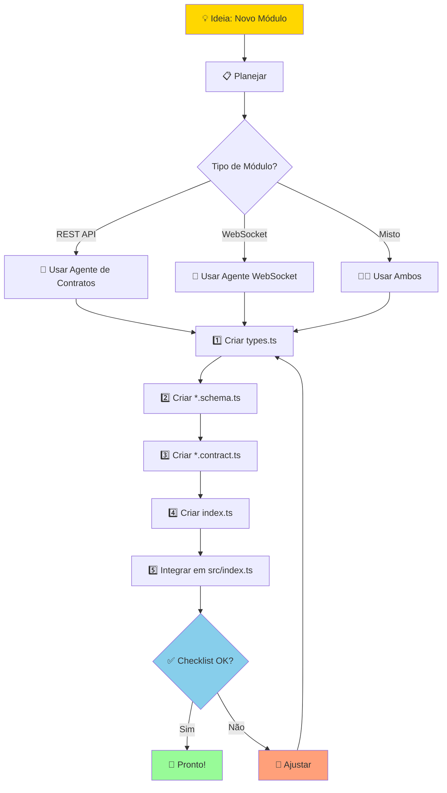
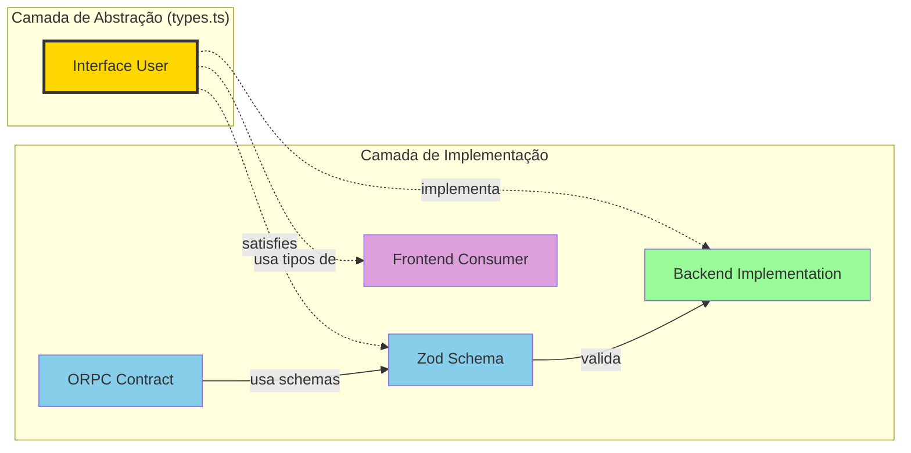
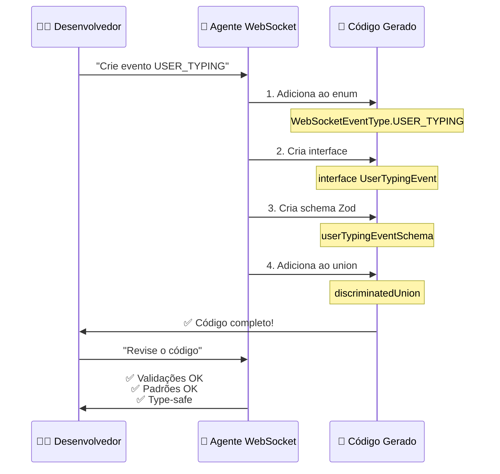
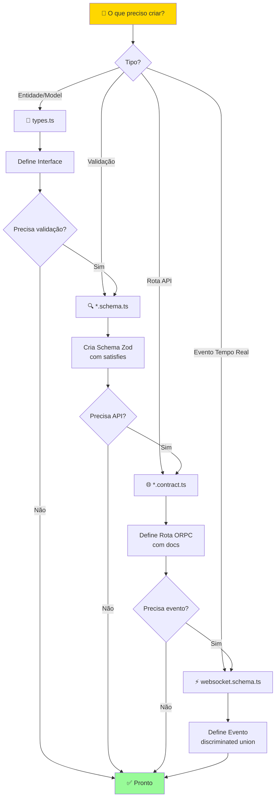
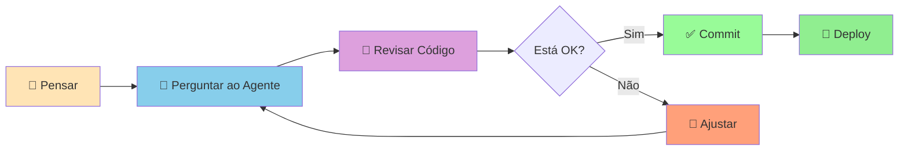
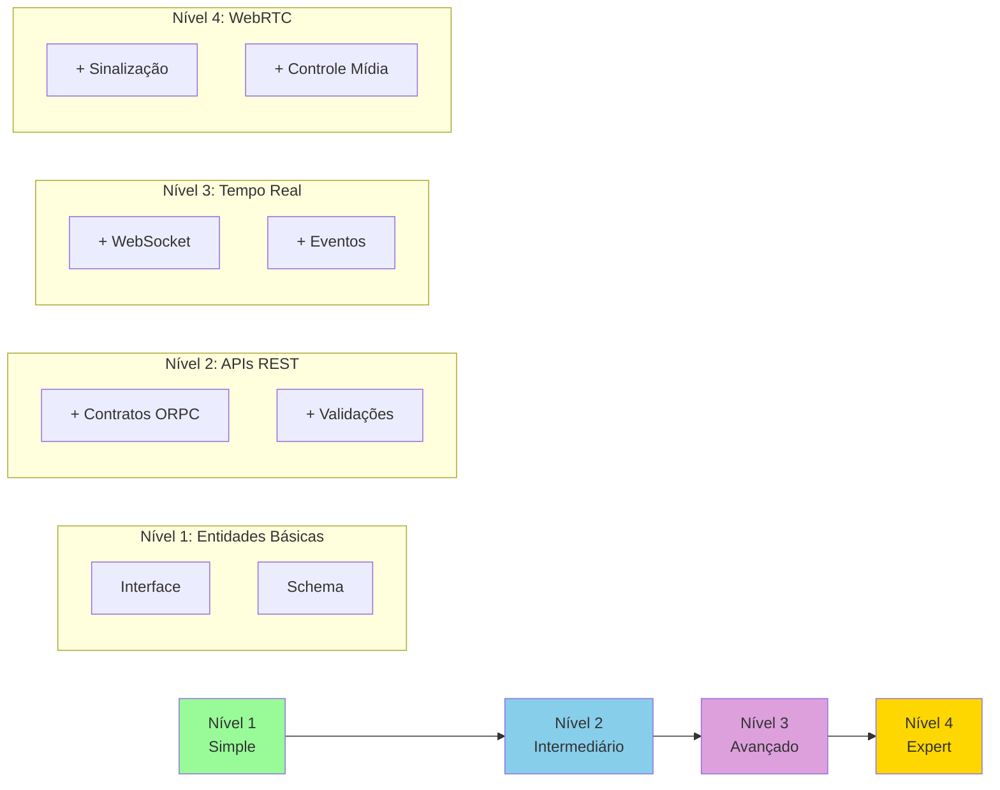
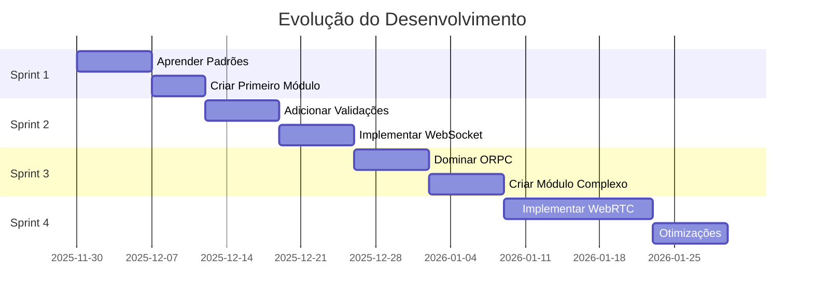

# 🎨 Guia Visual de Fluxo de Trabalho

Diagramas e fluxos visuais para trabalhar com os agentes de IA.

## 🔄 Fluxo de Criação de Módulo



## 🎯 Princípio de Inversão de Dependência



## 🔌 Fluxo de Eventos WebSocket



## 🏗️ Estrutura de Decisão



## 📊 Matriz de Decisão: Qual Agente Usar?

| Necessidade | Agente | Arquivo Alvo | Exemplo |
|------------|---------|--------------|---------|
| Criar novo módulo REST | 📦 Contratos | `src/modules/*/` | Produtos, Pedidos |
| Adicionar validações | 📦 Contratos | `*.schema.ts` | Email, CPF, UUID |
| Definir rotas API | 📦 Contratos | `*.contract.ts` | GET, POST, PATCH |
| Eventos de chat | 🔌 WebSocket | `websocket/` | MESSAGE_RECEIVED |
| Eventos de chamada | 🔌 WebSocket | `calls/` | CALL_STARTED |
| Sinalização WebRTC | 🔌 WebSocket | `calls/` | OFFER, ANSWER |
| Arquitetura geral | 🎯 Geral | Qualquer | Estrutura, DDD |

## 🎨 Padrão de Codificação Visual

### ✅ CERTO: Com Satisfies

```typescript
// 1. Interface limpa (types.ts)
┌─────────────────────────────┐
│ export interface User {     │
│   id: string                │
│   email: string             │
│   name: string              │
│ }                            │
└─────────────────────────────┘
            │
            │ satisfies
            ▼
// 2. Schema implementa (*.schema.ts)
┌─────────────────────────────────────┐
│ export const userSchema = z.object({│
│   id: z.string().uuid(),            │
│   email: z.email(),                 │
│   name: z.string().min(1),          │
│ }) satisfies z.ZodType<User>        │
└─────────────────────────────────────┘
            │
            │ garante compatibilidade
            ▼
        ✅ Type-safe!
```

### ❌ ERRADO: Sem Satisfies

```typescript
// Schema pode divergir da interface
┌─────────────────────────────┐
│ interface User {            │
│   id: string                │
│   email: string             │
│   name: string              │
│ }                            │
└─────────────────────────────┘
            │
            ✗ sem ligação
            ▼
┌─────────────────────────────┐
│ const userSchema = z.object(│
│   id: z.string(),           │
│   email: z.string(),        │
│   // name esquecido! 😢     │
│ })                          │
└─────────────────────────────┘
            │
            ▼
        ❌ Não type-safe!
```

## 🔄 Ciclo de Desenvolvimento



## 🎯 Prompt Templates Visuais

### Template 1: Módulo REST

```
┌────────────────────────────────────────┐
│ 📦 CRIAR MÓDULO [NOME]                 │
├────────────────────────────────────────┤
│                                        │
│ 📋 Entidades:                          │
│   • [Nome]: campo1, campo2, ...        │
│                                        │
│ 🏷️  Enums:                             │
│   • [Nome]: VALUE1, VALUE2, ...        │
│                                        │
│ 🌐 Rotas:                              │
│   • GET /[path] - listar               │
│   • POST /[path] - criar               │
│   • PATCH /[path]/:id - atualizar      │
│   • DELETE /[path]/:id - deletar       │
│                                        │
│ ✅ Seguir padrões DIP + satisfies      │
└────────────────────────────────────────┘
```

### Template 2: Evento WebSocket

```
┌────────────────────────────────────────┐
│ ⚡ CRIAR EVENTO [NOME]                  │
├────────────────────────────────────────┤
│                                        │
│ 🎯 Direção:                            │
│   ○ Cliente → Servidor                 │
│   ○ Servidor → Cliente                 │
│                                        │
│ 📦 Dados:                              │
│   • campo1: tipo (validação)           │
│   • campo2: tipo (validação)           │
│                                        │
│ 📝 Quando ocorre:                      │
│   [Descrição...]                       │
│                                        │
│ ✅ Padrão: enum + interface + schema   │
└────────────────────────────────────────┘
```

## 🗺️ Mapa Mental de Decisões

```
                    🤔 Preciso criar...
                           │
        ┌──────────────────┼──────────────────┐
        │                  │                  │
    🎨 UI/UX          📊 Dados           🔧 Lógica
        │                  │                  │
        │          ┌───────┴────────┐         │
        │          │                │         │
        │      📝 Tipo          🔍 Validação   │
        │          │                │         │
        │      types.ts        *.schema.ts    │
        │                          │          │
        │                  ┌───────┴────────┐ │
        │                  │                │ │
        │              🌐 REST        ⚡ WebSocket
        │                  │                │
        │          *.contract.ts   websocket/
        │                  │                │
        └──────────────────┴────────────────┴─┘
                           │
                      ✅ Completo!
```

## 📈 Níveis de Complexidade



## 🎓 Jornada de Aprendizado

```
👶 Iniciante
    │
    ├─ Entender DIP
    ├─ Aprender satisfies
    ├─ Criar primeiro módulo
    └─ Usar Pick/Omit/Extend
    
👨‍🎓 Intermediário
    │
    ├─ Criar rotas ORPC completas
    ├─ Adicionar validações customizadas
    ├─ Implementar eventos WebSocket
    └─ Usar discriminated unions
    
👨‍💻 Avançado
    │
    ├─ Arquitetar módulos complexos
    ├─ Implementar WebRTC
    ├─ Otimizar schemas
    └─ Contribuir com agentes
    
🧙 Expert
    │
    ├─ Criar novos padrões
    ├─ Mentoria de time
    ├─ Evoluir arquitetura
    └─ Liderar inovações
```

## 🎯 Objetivos por Sprint



## 🔍 Checklist Visual

### ✅ Novo Módulo

```
┌─────────────────────────────────┐
│ □ Criar diretório               │
│ □ types.ts com interfaces       │
│ □ *.schema.ts com satisfies     │
│ □ *.contract.ts com docs        │
│ □ index.ts com exports          │
│ □ Adicionar em src/index.ts    │
│ □ Testar imports                │
│ □ Documentar se necessário      │
└─────────────────────────────────┘
```

### ✅ Novo Evento WebSocket

```
┌─────────────────────────────────┐
│ □ Adicionar ao enum             │
│ □ Criar interface               │
│ □ Criar schema com z.literal()  │
│ □ Adicionar ao discriminated    │
│ □ Incluir timestamp             │
│ □ Adicionar requestId opcional  │
│ □ Documentar quando ocorre      │
│ □ Testar no cliente             │
└─────────────────────────────────┘
```

## 🎨 Paleta de Comandos

```bash
# 🚀 Comandos Rápidos para o Copilot

# Módulo
"Crie módulo de [nome]"
"Adicione validação em [campo]"
"Refatore usando Pick/Omit"

# WebSocket
"Adicione evento [NOME]"
"Implemente discriminated union"
"Crie base event schema"

# WebRTC
"Implemente sinalização offer/answer"
"Adicione controle de mídia"
"Crie evento de ICE candidate"

# Geral
"Revise este código"
"Como melhorar [aspecto]?"
"Exemplos de [conceito]"
```

---

**💡 Use este guia visual como referência rápida durante o desenvolvimento!**
