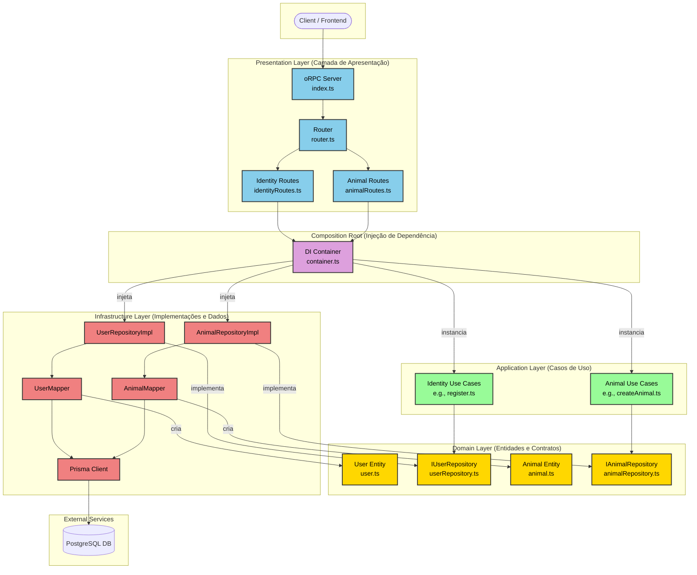

# Chat Monorepo

Sistema de chat completo com suporte a mensagens em tempo real, chamadas de áudio/vídeo e WebSocket.

## 🤖 Agentes de IA (GitHub Copilot)

Este projeto possui agentes de IA personalizados que aceleram o desenvolvimento e garantem consistência:

### 🚀 Quick Start

- 👋 **Novo no projeto?** → [Guia de Onboarding](.github/ONBOARDING.md)
- ⚡ **Precisa de referência?** → [Comandos Rápidos](.github/QUICK-REFERENCE.md)
- 💡 **Quer ver exemplos?** → [Exemplos Práticos](.github/EXAMPLES.md)
- ❓ **Tem dúvidas?** → [FAQ](.github/FAQ.md)

### 🤖 Agentes Disponíveis

| Agente                                                                       | Escopo       | Quando Usar                      |
| ---------------------------------------------------------------------------- | ------------ | -------------------------------- |
| 🎯 [Geral](.github/copilot-instructions.md)                                  | Todo projeto | Arquitetura, DDD, padrões gerais |
| 📦 [Contratos](packages/contracts/.github/copilot-instructions.md)           | APIs         | Schemas Zod, rotas ORPC          |
| 🔌 [WebSocket](packages/contracts/.github/copilot-websocket-instructions.md) | Tempo Real   | Eventos, WebRTC                  |

**📚 [Documentação Completa](.github/README.md)** | **📑 [Índice Completo](.github/INDEX.md)**

> 💡 Os agentes carregam automaticamente baseado no arquivo que você está editando!

---

## 📐 Arquitetura

